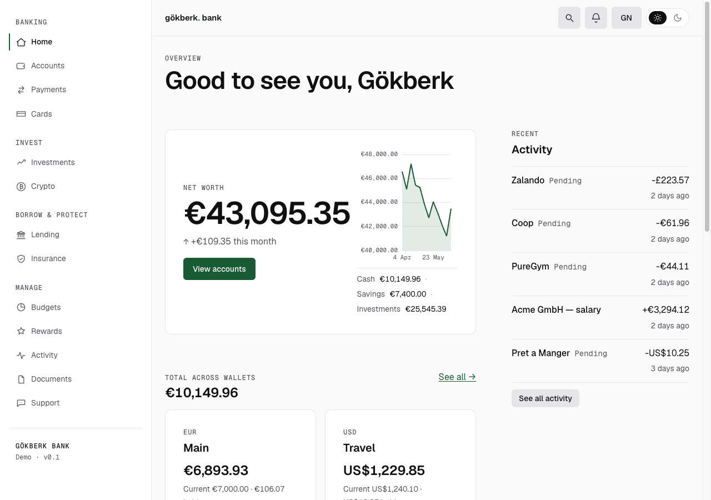
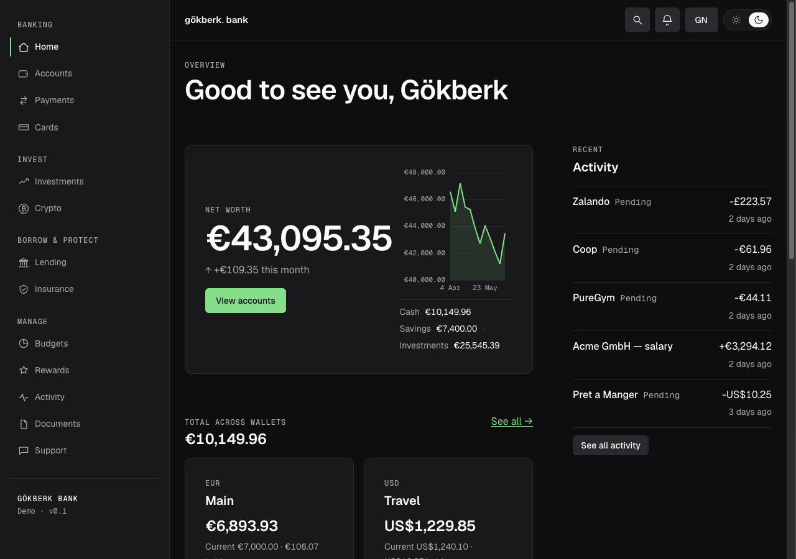

# gökberk bank

gökberk bank is my "imaginary" banking/finance application. The idea is to create the banking experience
I am looking for, where I can manage my own finances in one place and not rely on 5 other fintech apps.

I built this application also for showcasing (dogfooding) for my design system.

Live link: **[bank.gokberk.se](https://bank.gokberk.se)**
Built with: **SvelteKit 2 · Svelte 5**

<p align="center">
  
  
</p>

## What's inside

- **Accounts & home** — EUR home + multi-currency wallets, balances, transactions, savings pots, statements
- **Payments** — SEPA / SEPA Instant, SWIFT, FX exchange, scheduled, direct debits, payees, split a bill
- **Cards** — physical / virtual / disposable, controls & limits, PIN & 3-DS, tiers (Standard / Plus / Metal)
- **Borrow & protect** — loans, mortgages (+ calculator), credit line, insurance quotes, policies & claims
- **Invest** — portfolio, order ticket, instruments, watchlists, funds & ETFs, dividends, crypto
- **Manage** — budgets & spend analytics, rewards, activity, documents & e-sign, support & disputes
- **Identity & security** — onboarding/KYC, 2FA (OTP) + passkey, step-up re-auth, devices & sessions
- **⌘K command menu** — search anything, run any action, jump to any section — keyboard-only

Frontend-only: mock, seeded, deterministic data. No real backend, money, or PII. Every screen is
composed from the published
[`@gokberknur/design-system`](https://www.npmjs.com/package/@gokberknur/design-system) `gok-*` web
components and `--gok-*` tokens.

## Stack

- **SvelteKit 2 · Svelte 5** (runes) · TypeScript · Vite
- `@sveltejs/adapter-static` → a pure client **SPA** (`ssr=false`) — the `gok-*` elements are web
  components that register and render in the browser
- TradingView Lightweight Charts + Apache ECharts for charts · a token lint
  (`scripts/check-tokens.mjs`) that fails the build on any off-system `--gok-*` value · Playwright e2e
- Deployed to Cloudflare Pages · Node 24

The design-system *source* repo is private — only its built `dist/` is on npm. This app is the public
consumer; how it's built lives in [`CLAUDE.md`](CLAUDE.md).

## Commands

```bash
npm install
npm run dev        # Vite dev server
npm run build      # static build → ./build
npm run preview    # preview the production build
npm run check      # svelte-check (strict) + token lint
npm run test:e2e   # Playwright end-to-end suite
```

---

MIT © [Gökberk Nur](https://gokberk.se)
